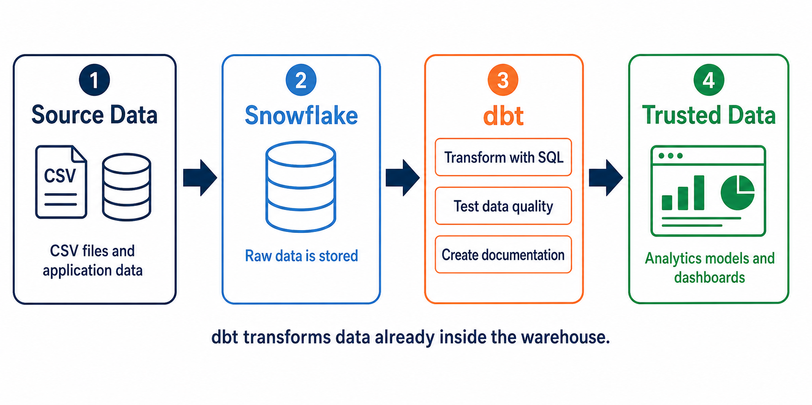
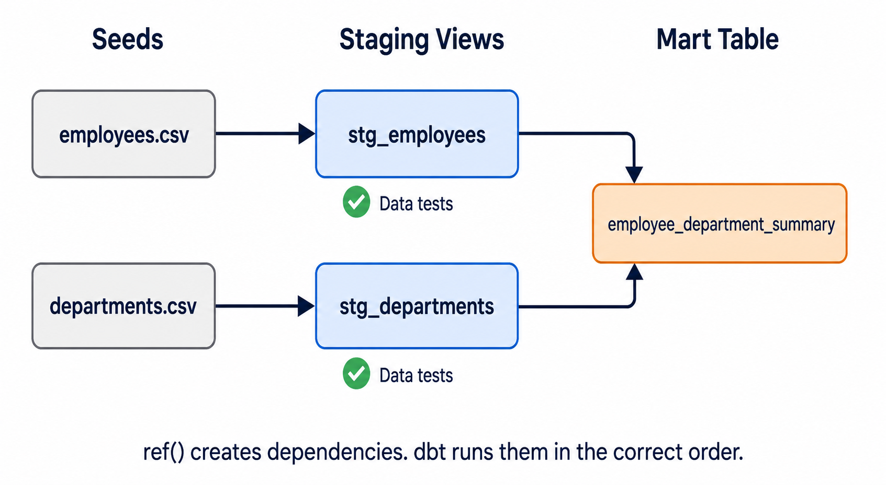

# Hands-On: Build Your First dbt Project

[← Back to Contents](README.md#course-contents) · [⌂ Back to Home Page](README.md)

This practical builds a small employee analytics project with dbt Core and Snowflake. It assumes no previous dbt knowledge. Complete each command and code example in order, then inspect the result before moving forward.

## Learning Approach

Use the same rhythm for every step:

1. **Explain** what the next file or command does.
2. **Type** it in front of the students instead of pasting it silently.
3. **Predict** what Snowflake or dbt will create.
4. **Run** the command.
5. **Inspect** the terminal output and Snowflake object.
6. **Change** one line and run it again so students see cause and effect.

## What Students Will Build

```text
CSV seed files
      ↓
stg_employees + stg_departments
      ↓
employee_department_summary
      ↓
tests + documentation + lineage
```

The ready-to-use example is in [`practical/employee_analytics`](practical/employee_analytics).

## 1. Understand dbt Before Writing Code



### dbt in Plain English

dbt means **data build tool**. It helps a data team transform data that is already stored in a warehouse such as Snowflake.

Without dbt, an analyst may run this query manually:

```sql
select *
from raw.employees
where status = 'ACTIVE';
```

The result disappears when the query window closes unless the analyst manually creates a table or view. With dbt, the `select` statement is saved in a `.sql` model file. dbt then:

1. Reads the SQL file.
2. Resolves dependencies such as `ref('stg_employees')`.
3. Generates the final Snowflake SQL.
4. Creates or replaces a view or table.
5. Runs data-quality tests.
6. Records metadata for documentation and lineage.

### What dbt Does and Does Not Do

| dbt does | dbt does not do in this tutorial |
| --- | --- |
| Transform warehouse data with SQL | Extract data from business applications |
| Build tables and views | Replace Snowflake |
| Test data quality | Create BI dashboards |
| Track dependencies with `ref()` | Store source data outside the warehouse |
| Generate documentation and lineage | Automatically decide business rules |

### Words Students Must Know

| Term | Beginner meaning |
| --- | --- |
| Project | The folder containing dbt code and configuration |
| Model | A `.sql` file containing one transformation query |
| Materialization | How a model is saved, such as a view or table |
| Seed | A small CSV file loaded by dbt for learning or reference data |
| `ref()` | A function that links one dbt resource to another |
| Test | A query that looks for invalid data |
| DAG | The dependency graph showing the correct build order |
| Target | A connection environment such as development or production |

## 2. Download and Install dbt Core

### What Students Need to Download

For this course, students use the stable dbt Core workflow with the Snowflake adapter.

1. **Python:** Download it from [python.org/downloads](https://www.python.org/downloads/). Python 3.10–3.12 is a conservative classroom choice across recent dbt Core releases.
2. **Git:** Download it from [git-scm.com/downloads](https://git-scm.com/downloads) if students will clone the course repository.
3. **VS Code:** Download it from [code.visualstudio.com](https://code.visualstudio.com/) to edit SQL and YAML files.
4. **dbt Core:** Install it from the terminal with `pip`; there is no separate dbt Core desktop application required for this tutorial.

When installing Python on Windows, select **Add python.exe to PATH** before choosing **Install Now**.

### Get the Course Files

Students can use either method:

- In GitHub, select **Code → Download ZIP**, extract the ZIP, and open the folder in VS Code.
- If a course Git URL is available, run `git clone <course-repository-url>`.

### Windows Installation

Open the repository in VS Code, select **Terminal → New Terminal**, and run each command separately:

```powershell
python --version
python -m venv .venv
.\.venv\Scripts\Activate.ps1
python -m pip install --upgrade pip
python -m pip install dbt-snowflake
dbt --version
```

Line by line:

- `python --version` confirms that Windows can find Python.
- `python -m venv .venv` creates an isolated environment inside `.venv`.
- `Activate.ps1` makes the terminal use that environment.
- `pip install --upgrade pip` updates Python's package installer.
- `pip install dbt-snowflake` downloads the Snowflake adapter and automatically installs dbt Core.
- `dbt --version` should list both `dbt-core` and the `snowflake` adapter.

If PowerShell blocks activation, students can run dbt directly without changing execution policy:

```powershell
.\.venv\Scripts\python.exe -m pip install --upgrade pip
.\.venv\Scripts\python.exe -m pip install dbt-snowflake
.\.venv\Scripts\dbt.exe --version
```

### macOS or Linux Installation

```bash
python3 --version
python3 -m venv .venv
source .venv/bin/activate
python -m pip install --upgrade pip
python -m pip install dbt-snowflake
dbt --version
```

### Installation Checkpoint

Do not continue until these commands work:

```powershell
python --version
dbt --version
dbt --help
```

Common problems:

| Problem | Fix |
| --- | --- |
| `python` is not recognized | Reinstall Python with **Add to PATH** selected, then reopen VS Code |
| Script execution is disabled | Use the direct `.venv\Scripts\dbt.exe` commands shown above |
| `dbt` is not recognized | Activate `.venv`, then rerun `dbt --version` |
| Snowflake adapter is missing | Run `python -m pip install --upgrade dbt-snowflake` |

## 3. Prepare Snowflake — Administrator Setup

The following is a one-time environment setup performed by a Snowflake administrator.

```sql
use role accountadmin;

create warehouse if not exists COMPUTE_WH
    warehouse_size = 'XSMALL'
    auto_suspend = 60
    auto_resume = true;

create database if not exists ANALYTICS;
create role if not exists TRANSFORMER;

grant usage on warehouse COMPUTE_WH to role TRANSFORMER;
grant usage on database ANALYTICS to role TRANSFORMER;
grant create schema on database ANALYTICS to role TRANSFORMER;

grant role TRANSFORMER to user <STUDENT_USERNAME>;
```

Line by line:

- `use role accountadmin` selects an administrative role for setup.
- `create warehouse` creates the compute used to execute SQL.
- `XSMALL` keeps the classroom warehouse small.
- `auto_suspend = 60` stops billing after 60 idle seconds.
- `auto_resume = true` restarts the warehouse when a query arrives.
- `create database` creates the location for student schemas.
- `create role` creates the role used by dbt.
- The `grant` statements allow the role to use the warehouse and create schemas.
- Replace `<STUDENT_USERNAME>` and run the final grant once for each student.

Before starting, obtain these five values from the Snowflake administrator:

- Snowflake account identifier
- Username
- Password or approved authentication method
- Role: `TRANSFORMER`
- Database and warehouse: `ANALYTICS` and `COMPUTE_WH`

## 4. Open and Tour the Practical Project

From the repository root:

```powershell
cd practical/employee_analytics
```

- `cd` means change directory.
- `practical/employee_analytics` is the ready-to-run dbt project folder.


Before running dbt, verify that every file shown in the image is present in the project.

## 5. Understand `dbt_project.yml`

Open [`dbt_project.yml`](practical/employee_analytics/dbt_project.yml):

```yaml
name: employee_analytics
version: "1.0.0"
config-version: 2

profile: employee_analytics

model-paths: ["models"]
seed-paths: ["seeds"]

clean-targets:
  - "target"
  - "dbt_packages"

models:
  employee_analytics:
    staging:
      +materialized: view
    marts:
      +materialized: table
```

Line by line:

- `name` identifies the dbt project.
- `version` records the project version; it is not the dbt version.
- `config-version: 2` selects dbt's current project configuration format.
- `profile` must match the top-level name in `profiles.yml`.
- `model-paths` tells dbt where SQL models live.
- `seed-paths` tells dbt where CSV seed files live.
- `clean-targets` lists generated folders removed by `dbt clean`.
- `models` begins model configuration for this project.
- `staging` models are built as views.
- `marts` models are built as tables.

## 6. Configure the Snowflake Connection

Create a working profile from the safe example:

```powershell
Copy-Item profiles.yml.example profiles.yml
```

Open `profiles.yml` and review it:

```yaml
employee_analytics:
  target: dev
  outputs:
    dev:
      type: snowflake
      account: "{{ env_var('DBT_SNOWFLAKE_ACCOUNT') }}"
      user: "{{ env_var('DBT_SNOWFLAKE_USER') }}"
      password: "{{ env_var('DBT_SNOWFLAKE_PASSWORD') }}"
      role: TRANSFORMER
      database: ANALYTICS
      warehouse: COMPUTE_WH
      schema: "DBT_{{ env_var('DBT_STUDENT_SCHEMA') }}"
      threads: 4
```

Line by line:

- `employee_analytics` matches the `profile` value in `dbt_project.yml`.
- `target: dev` selects the development connection.
- `outputs` contains the available connection targets.
- `type: snowflake` tells dbt which adapter to use.
- `account`, `user`, and `password` read secrets from environment variables.
- `role` controls Snowflake permissions.
- `database` and `warehouse` select where dbt stores data and runs SQL.
- `schema` creates a separate location such as `DBT_JAY` for each student.
- `threads: 4` allows dbt to execute up to four independent tasks concurrently.

Set the values for the current PowerShell window:

```powershell
$env:DBT_SNOWFLAKE_ACCOUNT = "your_account_identifier"
$env:DBT_SNOWFLAKE_USER = "your_username"
$env:DBT_SNOWFLAKE_PASSWORD = "your_password"
$env:DBT_STUDENT_SCHEMA = "your_first_name"
dbt debug --profiles-dir .
```

- The first four commands provide connection values without writing credentials into Git-tracked files.
- The account identifier is normally in the form `organization-account`; do not paste the full Snowflake URL.
- Use a short schema value containing letters, numbers, or underscores, such as `JAY` or `STUDENT_01`.
- `dbt debug` validates the project, profile, adapter, and database connection.
- `--profiles-dir .` tells dbt to use the profile in the current teaching folder.

Do not continue until `dbt debug` reports a successful connection.

## 7. Load the Seed Data

Open [`seeds/employees.csv`](practical/employee_analytics/seeds/employees.csv):

```csv
employee_id,employee_name,department_id,salary,status
1,Asha,10,85000,ACTIVE
2,Marco,20,72000,ACTIVE
3,Lin,10,91000,ACTIVE
4,Sofia,30,68000,INACTIVE
5,Noah,20,76000,ACTIVE
```

- The first row defines column names.
- Each later row represents one employee.
- `department_id` will be used to join employees to departments.

Load both CSV files into Snowflake:

```powershell
dbt seed --profiles-dir .
```

What happens:

1. dbt reads the files in `seeds/`.
2. dbt creates Snowflake tables named `employees` and `departments`.
3. dbt inserts the CSV rows into those tables.

Confirm the loaded rows:

```powershell
dbt show --select employees --profiles-dir .
dbt show --select departments --profiles-dir .
```

## 8. Build the First Staging Model

Open [`models/staging/stg_employees.sql`](practical/employee_analytics/models/staging/stg_employees.sql):

```sql
select
    employee_id::integer as employee_id,
    trim(employee_name) as employee_name,
    department_id::integer as department_id,
    salary::number(12, 2) as salary,
    upper(status) as status
from {{ ref('employees') }}
```

Line by line:

- `select` begins the transformation query.
- `employee_id::integer` enforces a numeric employee identifier.
- `trim(employee_name)` removes accidental spaces from names.
- `department_id::integer` creates a consistent join key.
- `salary::number(12, 2)` gives salary a predictable numeric type.
- `upper(status)` standardizes values such as `active` and `ACTIVE`.
- `ref('employees')` points to the seed and creates a dbt dependency.

Run only this model:

```powershell
dbt run --select stg_employees --profiles-dir .
dbt show --select stg_employees --profiles-dir .
```

- `dbt run` builds the model in Snowflake.
- `--select stg_employees` limits the run to one model.
- `dbt show` previews the model's rows in the terminal.

## 9. Build a Model with Two Dependencies



Open [`models/marts/employee_department_summary.sql`](practical/employee_analytics/models/marts/employee_department_summary.sql):

```sql
select
    d.department_id,
    d.department_name,
    count(e.employee_id) as employee_count,
    sum(case when e.status = 'ACTIVE' then 1 else 0 end) as active_employee_count,
    round(avg(e.salary), 2) as average_salary
from {{ ref('stg_departments') }} as d
left join {{ ref('stg_employees') }} as e
    on d.department_id = e.department_id
group by
    d.department_id,
    d.department_name
```

Line by line:

- `d.department_id` and `d.department_name` define one output row per department.
- `count(e.employee_id)` counts employees in each department.
- `sum(case ...)` counts only active employees.
- `avg(e.salary)` calculates average salary; `round` keeps two decimal places.
- The first `ref()` creates a dependency on `stg_departments`.
- The second `ref()` creates a dependency on `stg_employees`.
- `left join` keeps a department even when it has no employees.
- `on` defines the matching key.
- `group by` produces department-level results.

Build the model and everything before it:

```powershell
dbt run --select +employee_department_summary --profiles-dir .
dbt show --select employee_department_summary --profiles-dir .
```

The leading `+` means “include all upstream dependencies.” This is dbt lineage in action.

## 10. Add Data Tests

Open [`models/staging/_staging.yml`](practical/employee_analytics/models/staging/_staging.yml):

```yaml
version: 2

models:
  - name: stg_employees
    columns:
      - name: employee_id
        data_tests:
          - not_null
          - unique
      - name: department_id
        data_tests:
          - not_null
          - relationships:
              arguments:
                to: ref('stg_departments')
                field: department_id
      - name: status
        data_tests:
          - accepted_values:
              arguments:
                values: ['ACTIVE', 'INACTIVE']
```

Line by line:

- `version: 2` enables dbt resource properties.
- `models` starts the list of documented models.
- `name: stg_employees` connects this YAML to the SQL model.
- `columns` starts column-level configuration.
- `not_null` rejects missing values.
- `unique` rejects duplicate employee identifiers.
- `relationships` checks that every department exists in `stg_departments`.
- `accepted_values` limits status to the approved business values.

Run the tests:

```powershell
dbt test --profiles-dir .
```

A passing test returns zero invalid rows. A failing test returns one or more invalid rows.

## 11. Run the Entire Project

```powershell
dbt build --profiles-dir .
```

`dbt build` processes seeds, models, and tests in dependency order. If an upstream test fails, dbt can skip downstream resources that should not be built from bad data.

Read the final line:

```text
PASS=... WARN=... ERROR=... SKIP=... TOTAL=...
```

- `PASS` means successful resources.
- `WARN` means non-blocking issues.
- `ERROR` means failed resources.
- `SKIP` usually means an upstream dependency failed.

## 12. Make a Test Fail on Purpose

In `seeds/employees.csv`, change Noah's status from `ACTIVE` to `UNKNOWN`.

Then run:

```powershell
dbt seed --profiles-dir .
dbt test --select stg_employees --profiles-dir .
```

The `accepted_values` test should fail. Change `UNKNOWN` back to `ACTIVE`, reload the seed, and rerun the test. This shows students that dbt tests data, not just SQL syntax.

## 13. Generate Documentation and View Lineage

```powershell
dbt docs generate --profiles-dir .
dbt docs serve --profiles-dir .
```

- `dbt docs generate` creates the catalog and project metadata.
- `dbt docs serve` starts a local documentation website.
- Open the lineage graph and trace the path from seeds to staging models to the mart.
- Press `Ctrl+C` in the terminal when the class is finished.

## 14. Command Reference

| Command | Purpose |
| --- | --- |
| `dbt debug` | Validate project setup and connectivity |
| `dbt seed` | Load small CSV reference data |
| `dbt run` | Build SQL models |
| `dbt test` | Run configured data tests |
| `dbt build` | Build and test resources in DAG order |
| `dbt show` | Preview model or resource results |
| `dbt docs generate` | Generate documentation metadata |
| `dbt docs serve` | Open documentation and lineage locally |

## Official References

- [Install dbt locally](https://docs.getdbt.com/docs/local/install-dbt)
- [dbt init command](https://docs.getdbt.com/reference/commands/init)
- [dbt build command](https://docs.getdbt.com/reference/commands/build)
- [dbt seed command](https://docs.getdbt.com/reference/commands/seed)
- [dbt data tests](https://docs.getdbt.com/docs/build/data-tests)
- [Snowflake setup for dbt Core](https://docs.getdbt.com/docs/local/connect-data-platform/snowflake-setup)

---

[← Back to Contents](README.md#course-contents) · [⌂ Back to Home Page](README.md)
