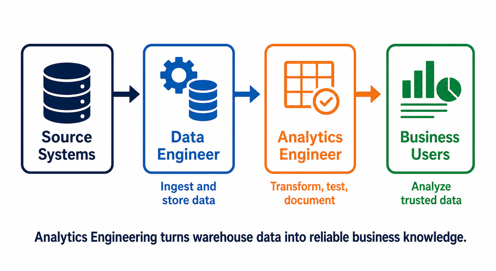

# DBT Analytics Engineering

[← Back to Contents](README.md#course-contents) · [⌂ Back to Home Page](README.md)

# Chapter Overview

Modern organizations generate data from dozens of systems every day. However, data by itself has very little value unless it can be transformed into meaningful business insights.

This chapter introduces Analytics Engineering, one of the fastest-growing disciplines in the data industry. Understanding Analytics Engineering is critical before learning dbt because dbt was specifically designed to solve Analytics Engineering problems.

## Visual Guide



### Diagram Explanation

1. Source systems create operational data from sales, finance, HR, websites, and applications.
2. Data engineers move and store that data reliably in a warehouse. Their work makes data available.
3. Analytics engineers transform warehouse data into consistent business models. Their work makes data understandable and trustworthy.
4. Business users consume those models in reports, dashboards, and analysis instead of repeatedly cleaning raw tables.
5. The boundaries can overlap between companies, but the central analytics-engineering responsibility remains: transform, test, document, and organize business logic.

For example, **loading a Salesforce table** is typically data engineering, **defining revenue** is analytics engineering, and **building a dashboard** is business intelligence.

---

# Learning Objectives

After completing this chapter, you will be able to:

* Define Analytics Engineering
* Explain why Analytics Engineering emerged
* Understand the responsibilities of Analytics Engineers
* Differentiate Analytics Engineering from Data Engineering
* Understand how Analytics Engineers support business users
* Explain the relationship between Analytics Engineering and dbt

---

# Why Data Alone Is Not Enough

Every organization collects data.

Examples include:

* Customer information
* Product information
* Employee records
* Financial transactions
* Website activity
* Mobile application events

Consider a company that stores employee data.

### Raw Employee Table

| empno | ename | deptno |
| ----- | ----- | ------ |
| 7369  | smith | 20     |
| 8015  | sIMON | 30     |

Although this information exists, it is not easy for business users to understand.

A business manager may ask:

* What does empno mean?
* Which department does 20 represent?
* Why are employee names inconsistent?
* Can this data be trusted?

Business users prefer data that looks like this:

### Business-Friendly Employee Table

| employee_id | employee_name | department_name |
| ----------- | ------------- | --------------- |
| 7369        | Smith         | Research        |
| 8015        | Simon         | Sales           |

The process of converting technical data into business-friendly data is one of the core responsibilities of Analytics Engineers.

---

# Evolution of Data Teams

The role of Analytics Engineering emerged gradually as organizations became more data-driven.

## Phase 1 – Database Administration

In the early years of enterprise computing, organizations primarily focused on managing databases.

Responsibilities included:

* Creating databases
* Managing users
* Backup and recovery
* Security
* Performance tuning

Professionals responsible for these activities were known as Database Administrators (DBAs).

---

## Phase 2 – ETL Development

As reporting requirements increased, organizations needed a way to move data between systems.

This led to the creation of ETL tools such as:

* Informatica
* DataStage
* SSIS
* Ab Initio

ETL developers were responsible for:

* Extracting data
* Transforming data
* Loading data

---

## Phase 3 – Data Engineering

Cloud computing introduced a new set of challenges.

Organizations needed professionals capable of:

* Building scalable data pipelines
* Managing cloud infrastructure
* Handling large datasets
* Supporting real-time processing

This led to the rise of Data Engineering.

Common technologies include:

* Snowflake
* AWS Glue
* Databricks
* Apache Spark
* Kafka

---

## Phase 4 – Analytics Engineering

Even after data was successfully loaded into cloud warehouses, organizations discovered another problem.

Business users still struggled to use the data effectively.

Reasons included:

* Poor naming conventions
* Missing business logic
* Lack of documentation
* Data quality issues
* Complex schemas

Analytics Engineering emerged to solve these challenges.

---

# What Is Analytics Engineering?

Analytics Engineering is the discipline responsible for transforming raw data into trusted, reusable, business-ready datasets.

Analytics Engineers combine skills from:

* Data Engineering
* Software Engineering
* Business Intelligence
* Data Modeling

Their goal is to create datasets that business users can trust and understand.

---

# Where Analytics Engineers Fit

A simplified view of a modern data platform is shown below.

```text
Source Systems
       ↓
Data Engineers
       ↓
Data Warehouse
       ↓
Analytics Engineers
       ↓
Business Users
```

Data Engineers focus on moving data.

Analytics Engineers focus on preparing data for business consumption.

---

# Responsibilities of Analytics Engineers

## Data Modeling

Analytics Engineers design business-friendly data models.

Examples:

* Customer Dimension
* Product Dimension
* Employee Dimension
* Sales Fact Table

Good models simplify reporting and analytics.

---

## Data Quality

Analytics Engineers ensure that data is accurate and reliable.

Examples:

* Employee IDs must be unique
* Customer IDs cannot be null
* Orders must belong to valid customers

---

## Documentation

Analytics Engineers create documentation describing:

* Tables
* Columns
* Business definitions
* Calculations

Documentation reduces onboarding time and improves collaboration.

---

## Data Lineage

Data lineage answers questions such as:

* Where did this column originate?
* Which reports depend on this model?
* What will break if this model changes?

Lineage is essential in large organizations.

---

## Business Logic

Analytics Engineers implement business rules.

Example:

Business Rule:

Revenue should exclude cancelled orders.

Analytics Engineers translate this requirement into SQL transformations.

---

# Analytics Engineer vs Data Engineer

## Data Engineer

Primary Focus:

Moving and processing data.

Example:

```text
Salesforce
     ↓
AWS AppFlow
     ↓
S3
     ↓
Snowflake
```

Responsibilities:

* Data ingestion
* Pipeline development
* Infrastructure
* Automation

---

## Analytics Engineer

Primary Focus:

Transforming data into business-ready information.

Example:

```text
Snowflake
     ↓
dbt
     ↓
Business Models
     ↓
Power BI
```

Responsibilities:

* Data modeling
* Business logic
* Documentation
* Data quality
* Reporting support

---

# Real-World Example

Imagine a retail company.

Raw tables:

* customers_raw
* orders_raw
* products_raw
* payments_raw

Business users require:

* dim_customer
* dim_product
* fact_sales
* fact_orders

Analytics Engineers create these business-friendly datasets using tools such as dbt.

---

# Review and Applied Learning

## Reflection Question

Why can't executives directly query raw tables?

Key considerations:

* Technical column names
* Poor data quality
* Missing business context

Analytics Engineering exists specifically to bridge this gap.

---

## Architecture Exercise

Reference flow:

Source Systems

↓

Data Engineering

↓

Snowflake

↓

Analytics Engineering

↓

Power BI

Each layer has a distinct responsibility in producing trusted analytics data.

---

## Real Project Discussion

Using your employee dataset:

Raw:

| empno | ename |
| ----- | ----- |
| 7369  | smith |
| 8015  | sIMON |

Business Model:

| employee_id | employee_name |
| ----------- | ------------- |
| 7369        | Smith         |
| 8015        | Simon         |

This simple example demonstrates the purpose of Analytics Engineering.

---

# Knowledge Check

1. What is Analytics Engineering?
2. Why did Analytics Engineering emerge?
3. How does Analytics Engineering differ from Data Engineering?
4. What are the primary responsibilities of Analytics Engineers?
5. Why is data modeling important?

---

# Interview Questions

## Beginner

* What is Analytics Engineering?
* Why is Analytics Engineering important?
* What responsibilities do Analytics Engineers have?

## Intermediate

* How is Analytics Engineering different from Data Engineering?
* How does Analytics Engineering improve reporting quality?
* Why is documentation important?

## Scenario

A company has loaded data into Snowflake, but business users complain that reports are inconsistent.

How can Analytics Engineering help solve this problem?

---

# Assignment

Research three organizations that use modern cloud data platforms.

Identify:

* Data warehouse used
* Analytics tools used
* Responsibilities likely handled by Analytics Engineers

Prepare a one-page summary.

---

# Summary

Analytics Engineering bridges the gap between technical data systems and business users.

Analytics Engineers focus on:

* Data Modeling
* Data Quality
* Documentation
* Lineage
* Business Logic

These capabilities make analytics more reliable, scalable, and understandable for the entire organization.

---

[← Back to Contents](README.md#course-contents) · [⌂ Back to Home Page](README.md)
