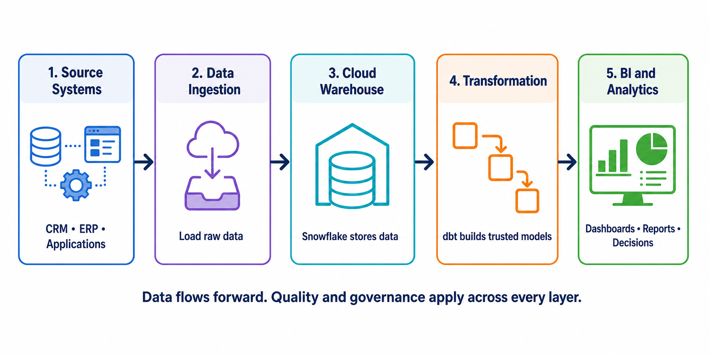

# Modern Data Stack

[← Back to Contents](README.md#course-contents) · [⌂ Back to Home Page](README.md)

## Visual Guide



### Diagram Explanation

1. Source systems are where business events originate; they are not designed for enterprise analytics.
2. Ingestion tools copy raw data into a central warehouse without defining every business rule first.
3. Snowflake separates storage from compute and provides the SQL environment used in this course.
4. dbt operates in the transformation layer. It reads warehouse data and builds cleaned, tested, documented models.
5. BI tools consume those trusted models. They should not contain many conflicting copies of core business logic.
6. Quality, security, ownership, and governance are cross-cutting concerns rather than one isolated tool.

For example, an online order moves from the source application through ingestion and warehouse storage before dbt transforms it into a dashboard-ready metric.

## Tinitiate AI Solutions

### dbt Analytics Engineering Bootcamp

---

# Chapter Overview

Over the last decade, the way organizations store, process, and analyze data has changed dramatically.

Traditional data platforms relied on expensive on-premise databases, ETL servers, and complex reporting systems.

Modern cloud technologies have simplified this architecture and created what is now known as the **Modern Data Stack**.

Understanding the Modern Data Stack is critical because dbt is one of its core components.

Before learning dbt, students must understand:

* Where data originates
* How data moves through systems
* Where transformations occur
* Where dbt fits into the overall architecture

---

# Learning Objectives

After completing this chapter, you will be able to:

* Define the Modern Data Stack
* Explain the components of a modern data platform
* Compare traditional and modern architectures
* Understand the role of cloud data warehouses
* Explain where dbt fits into the ecosystem
* Describe end-to-end data flow in modern organizations

---

# What Is a Data Stack?

A Data Stack refers to the collection of technologies used to:

* Collect data
* Store data
* Transform data
* Analyze data
* Visualize data

Think of a Data Stack as a complete ecosystem that enables organizations to convert raw data into business insights.

---

# Why Organizations Need Data Platforms

Consider a retail company.

The company uses multiple systems:

## Customer Management

Salesforce

## Finance

SAP

## Human Resources

Workday

## E-Commerce

Shopify

## Marketing

Google Analytics

## Support

Zendesk

Each system generates data independently.

Business users need a unified view of all this information.

For example:

* Total Revenue
* Customer Lifetime Value
* Product Performance
* Employee Productivity

To answer these questions, data from multiple systems must be combined.

This is where a data platform becomes necessary.

---

# Traditional Data Architecture

Before cloud computing, organizations typically used a traditional architecture.

```text
Source Systems
     ↓
ETL Server
     ↓
Enterprise Data Warehouse
     ↓
Reporting Tools
```

Example:

```text
SAP
Salesforce
Oracle

     ↓

Informatica

     ↓

Teradata

     ↓

Business Objects
```

---

# Challenges with Traditional Architecture

Traditional architectures worked, but they had limitations.

## Expensive Infrastructure

Organizations needed:

* Database Servers
* ETL Servers
* Storage Servers

Hardware costs were high.

---

## Limited Scalability

As data volumes increased, performance declined.

Organizations needed to purchase additional hardware.

Scaling was expensive and time-consuming.

---

## Long Development Cycles

New data pipelines often required:

* ETL Development
* Database Changes
* Infrastructure Requests

Projects could take months.

---

## Complex Maintenance

Multiple systems required:

* Monitoring
* Upgrades
* Patching
* Performance Tuning

Operations teams spent significant effort maintaining infrastructure.

---

# Rise of Cloud Computing

Cloud providers introduced a new approach.

Examples:

* Amazon Web Services (AWS)
* Microsoft Azure
* Google Cloud Platform (GCP)

Cloud computing offered:

* On-demand resources
* Pay-as-you-go pricing
* Elastic scaling
* Managed services

This transformed data architecture.

---

# The Modern Data Stack

A Modern Data Stack is a cloud-native architecture designed for analytics and business intelligence.

A typical architecture looks like this:

```text
Source Systems
      ↓
Data Ingestion
      ↓
Cloud Data Warehouse
      ↓
dbt
      ↓
Business Models
      ↓
Visualization
```

---

# Components of Modern Data Stack

Modern Data Stacks typically contain five major layers.

## Layer 1 – Source Systems

Data originates from:

* Salesforce
* SAP
* Workday
* PostgreSQL
* MySQL
* APIs
* CSV Files

These systems generate operational data.

---

## Layer 2 – Data Ingestion

Data must be moved into a central platform.

Common tools:

* Fivetran
* Airbyte
* AWS AppFlow
* Stitch
* Informatica Cloud

Responsibilities:

* Extract Data
* Load Data
* Schedule Loads
* Handle Incremental Updates

---

## Layer 3 – Cloud Data Warehouse

This is where data is stored.

Popular options:

### Snowflake

Most popular cloud data warehouse.

### BigQuery

Google Cloud platform.

### Redshift

AWS data warehouse.

### Databricks

Lakehouse architecture.

Responsibilities:

* Store data
* Execute SQL
* Scale compute
* Support analytics

---

# Why Snowflake Became Popular

Snowflake solved many traditional challenges.

Advantages include:

## Separate Compute and Storage

Storage and compute scale independently.

Organizations pay only for resources they use.

---

## Elastic Scaling

Workloads can scale automatically.

Heavy analytics does not impact other users.

---

## Simplicity

Minimal infrastructure management.

Organizations focus on analytics rather than maintenance.

---

## Cloud Native

Supports:

* AWS
* Azure
* GCP

---

# Layer 4 – Data Transformation

Once data reaches Snowflake, it is still not ready for business users.

Example:

Raw Employee Table

| empno | ename |
| ----- | ----- |
| 7369  | smith |
| 8015  | sIMON |

Business users expect:

| employee_id | employee_name |
| ----------- | ------------- |
| 7369        | Smith         |
| 8015        | Simon         |

This transformation layer is where dbt operates.

---

# Layer 5 – Analytics Engineering

Analytics Engineering focuses on:

* Data Modeling
* Documentation
* Testing
* Lineage
* Business Logic

dbt is the primary Analytics Engineering tool.

---

# Where dbt Fits

The most important diagram in this chapter is shown below.

```text
Salesforce
SAP
Workday
CSV Files

       ↓

Data Ingestion

       ↓

Snowflake

       ↓

dbt

       ↓

Business Models

       ↓

Power BI
Tableau
Looker
```

This is the architecture used by thousands of organizations worldwide.

---

# Understanding dbt's Position

Students often misunderstand where dbt fits.

Important:

dbt does NOT:

* Extract Data
* Load Data
* Replace Snowflake

dbt starts AFTER data is already inside Snowflake.

Its responsibility is transformation.

---

# Example End-to-End Workflow

Step 1

Salesforce contains customer data.

Step 2

Fivetran loads data into Snowflake.

Step 3

dbt creates:

```text
stg_customer
```

Step 4

dbt creates:

```text
dim_customer
```

Step 5

Power BI uses:

```text
dim_customer
```

for reporting.

---

# Modern Data Stack Roles

## Data Engineer

Responsible for:

* Data Ingestion
* Infrastructure
* Pipelines

---

## Analytics Engineer

Responsible for:

* dbt Models
* Documentation
* Data Quality
* Business Logic

---

## Data Analyst

Responsible for:

* Reporting
* Dashboards
* Business Insights

---

# Real-World Example

Using your Employee Analytics project:

```text
Employee Data
Department Data
Project Data

       ↓

Snowflake

       ↓

dbt

       ↓

dim_employee

fact_employee_projects

fact_department_salary

       ↓

Power BI Dashboard
```

This project architecture mirrors what students will build throughout this bootcamp.

---

# Review and Applied Learning

## Reflection Question

"Why can't organizations run reports directly from Salesforce?"

Key considerations:

* Performance Issues
* Multiple Systems
* Data Quality
* Historical Analysis

Centralization provides consistent history, performance, quality controls, and cross-system analysis.

---

## Architecture Exercise

Reference architecture:

```text
Sources
   ↓
Ingestion
   ↓
Warehouse
   ↓
dbt
   ↓
Reports
```

The flow progresses from operational sources to ingestion, centralized storage, transformation, and reporting.

---

## Real Industry Examples

Netflix

* Data Warehouse
* Transformation Layer
* Analytics Layer

Airbnb

* Data Warehouse
* dbt
* Reporting

Amazon

* Data Lake
* Warehouse
* Analytics Engineering

---

# Common Mistakes

## Mistake 1

Thinking Snowflake automatically cleans data.

It does not.

Transformation is still required.

---

## Mistake 2

Thinking dbt replaces ETL.

dbt complements ETL.

---

## Mistake 3

Thinking Power BI should connect directly to source systems.

This creates inconsistent reporting.

---

# Knowledge Check

1. What is a Data Stack?
2. What are the five layers of a Modern Data Stack?
3. Why did cloud data warehouses become popular?
4. Where does dbt fit?
5. What is the responsibility of Analytics Engineering?

---

# Interview Questions

## Beginner

What is the Modern Data Stack?

Name three cloud data warehouses.

Where does dbt fit?

---

## Intermediate

Why is Snowflake popular?

How does a Modern Data Stack differ from traditional architecture?

What role does Analytics Engineering play?

---

## Scenario

Your company currently uses Informatica and an on-premise warehouse.

Leadership wants to move to Snowflake and dbt.

What advantages would the Modern Data Stack provide?

---

# Assignment

Research:

* Snowflake
* BigQuery
* Redshift

Create a comparison document containing:

* Pricing Model
* Advantages
* Limitations
* Typical Use Cases

---

# Summary

The Modern Data Stack is a cloud-native architecture designed to simplify analytics.

Core layers include:

* Source Systems
* Data Ingestion
* Cloud Data Warehouse
* Analytics Engineering (dbt)
* Visualization

Understanding this architecture is critical because dbt operates within the transformation layer and enables organizations to create trusted, business-ready datasets.

---

[← Back to Contents](README.md#course-contents) · [⌂ Back to Home Page](README.md)
