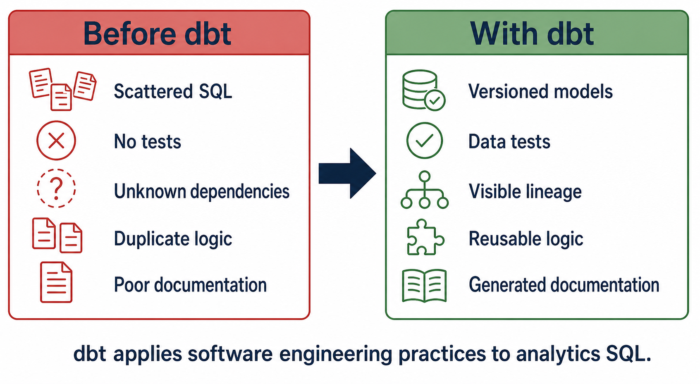

# Problems dbt Solves

[← Back to Contents](README.md#course-contents) · [⌂ Back to Home Page](README.md)

## Visual Guide



### How to Explain the Diagram

1. Scattered SQL becomes version-controlled model files with names, owners, and review history.
2. Assumptions about data quality become executable tests such as `not_null`, `unique`, and `relationships`.
3. Unknown query order becomes visible lineage created by `ref()` and `source()` dependencies.
4. Repeated business rules can be centralized in staging models, intermediate models, marts, or macros.
5. Tribal knowledge becomes generated documentation backed by YAML descriptions and warehouse metadata.

Important nuance: dbt provides the framework, but the team must still write correct business logic, meaningful tests, and useful documentation.

Ask students to identify which problem would create the greatest business risk in their own organization.

## Tinitiate AI Solutions

### dbt Analytics Engineering Bootcamp

---

# Chapter Overview

Before learning how to use dbt, it is important to understand why dbt was created.

Many organizations successfully load data into a warehouse such as Snowflake but still struggle with:

* Inconsistent reporting
* Poor documentation
* Data quality issues
* SQL duplication
* Lack of governance
* Dependency management problems

These challenges become more severe as organizations grow.

dbt was created to address these problems using software engineering principles.

---

# Learning Objectives

After completing this chapter, you will be able to:

* Identify common analytics challenges
* Understand why SQL-only environments become difficult to manage
* Explain the concept of analytics engineering governance
* Describe how dbt solves common enterprise data problems
* Explain the business value of dbt

---

# Life Before dbt

Imagine a company with:

* Salesforce
* SAP
* Oracle
* Workday

Data is loaded into Snowflake.

Developers begin writing SQL.

Example:

```sql
create table customer_summary as ...
```

```sql
create table sales_summary as ...
```

```sql
create table revenue_summary as ...
```

Initially everything appears manageable.

However, over time the number of scripts grows.

After several years:

* Hundreds of SQL files
* Multiple developers
* Multiple teams
* Different naming standards

This environment becomes difficult to manage.

---

# Problem 1 – SQL Sprawl

One of the biggest problems in analytics environments is SQL sprawl.

SQL sprawl occurs when business logic is scattered across many files and systems.

Example:

Revenue calculation exists in:

* Power BI
* Tableau
* Excel
* Snowflake Views
* Stored Procedures

Every implementation becomes slightly different.

---

# Real World Example

Finance Team Revenue:

```sql
Revenue = Sales - Returns
```

Sales Team Revenue:

```sql
Revenue = Sales
```

Executive Dashboard Revenue:

```sql
Revenue = Sales - Returns - Discounts
```

Now three different revenue numbers exist.

Which one is correct?

Nobody knows.

---

# How dbt Solves SQL Sprawl

dbt centralizes business logic.

Example:

```text
fact_sales
```

contains the official revenue calculation.

Every dashboard references the same model.

Benefits:

* Single source of truth
* Consistent reporting
* Easier maintenance

---

# Problem 2 – No Documentation

Imagine a table:

```text
customer_summary_v4_final
```

Questions:

* Who created it?
* Why was it created?
* What logic does it contain?
* Is it still being used?

Often nobody knows.

---

# Consequences of Poor Documentation

New employees struggle to understand systems.

Projects take longer.

Knowledge remains trapped with individual developers.

Organizations become dependent on specific people.

---

# Real World Scenario

Senior developer leaves the company.

A business-critical report fails.

Nobody understands the SQL.

The organization faces significant risk.

---

# How dbt Solves Documentation Problems

dbt automatically generates documentation.

Documentation includes:

* Model descriptions
* Column descriptions
* Dependencies
* Ownership information

Command:

```bash
dbt docs generate
```

This dramatically improves project transparency.

---

# Problem 3 – Data Quality Issues

Poor data quality causes business problems.

Examples:

Employee Data:

| employee_id |
| ----------- |
| NULL        |

Customer Data:

| customer_id |
| ----------- |
| 1001        |
| 1001        |

Problems:

* Duplicate records
* Missing values
* Invalid relationships

Reports become unreliable.

---

# Business Impact of Bad Data

Consider a sales dashboard.

If customer IDs are duplicated:

* Revenue becomes inflated
* Customer counts become inaccurate
* Executive decisions become incorrect

Bad data directly impacts business outcomes.

---

# How dbt Solves Data Quality Issues

dbt provides automated testing.

Examples:

## Unique Test

```yaml
tests:
  - unique
```

Ensures values are unique.

---

## Not Null Test

```yaml
tests:
  - not_null
```

Ensures required values exist.

---

## Relationship Test

```yaml
tests:
  - relationships
```

Validates foreign key relationships.

---

## Accepted Values Test

```yaml
tests:
  - accepted_values
```

Validates allowed values.

---

# Problem 4 – Lack of Dependency Visibility

Imagine:

```text
stg_orders
     ↓
fact_sales
     ↓
executive_dashboard
```

A developer modifies:

```text
stg_orders
```

Questions:

* Which models are impacted?
* Which dashboards break?
* Which reports require validation?

Without lineage this becomes difficult.

---

# Consequences

Teams spend significant time:

* Troubleshooting
* Impact Analysis
* Manual Investigation

Changes become risky.

---

# How dbt Solves Dependency Problems

dbt automatically creates lineage.

Example:

```text
orders_raw
      ↓
stg_orders
      ↓
fact_sales
      ↓
executive_dashboard
```

Benefits:

* Easier troubleshooting
* Better governance
* Faster impact analysis

---

# Problem 5 – Duplicate Business Logic

Organizations often copy SQL repeatedly.

Example:

```sql
upper(trim(customer_name))
```

appears in:

* 20 models
* 10 reports
* 5 dashboards

Business rule changes require updates everywhere.

---

# How dbt Solves Reusability Problems

dbt provides macros.

Example:

```sql
{{ clean_customer_name(customer_name) }}
```

Benefits:

* Write once
* Reuse everywhere
* Easier maintenance

---

# Problem 6 – Difficult Collaboration

Without standards:

Developer A creates:

```text
customer_summary
```

Developer B creates:

```text
cust_summary
```

Developer C creates:

```text
customer_final_v2
```

Projects become inconsistent.

---

# How dbt Solves Collaboration Challenges

dbt encourages:

* Naming Standards
* Folder Structure
* Version Control
* Code Reviews

Teams follow common development practices.

---

# Problem 7 – Lack of Version Control

Without Git:

* Changes are difficult to track
* Rollbacks are difficult
* Auditing becomes impossible

---

# How dbt Solves Version Control Problems

dbt integrates directly with Git.

Benefits:

* Branching
* Pull Requests
* Code Reviews
* Change History

Organizations gain software engineering discipline.

---

# Problem 8 – Slow Development

Without standards:

Every developer:

* Writes SQL differently
* Documents differently
* Tests differently

Development slows significantly.

---

# How dbt Improves Productivity

dbt provides:

* Standard project structures
* Reusable components
* Automated documentation
* Automated testing

Development becomes faster and more consistent.

---

# Summary Table

| Problem                | dbt Solution       |
| ---------------------- | ------------------ |
| SQL Sprawl             | Centralized Models |
| No Documentation       | dbt Docs           |
| Poor Data Quality      | Tests              |
| No Dependency Tracking | Lineage            |
| Duplicate Logic        | Macros             |
| Poor Collaboration     | Standards          |
| No Version Control     | Git Integration    |
| Slow Development       | Reusable Framework |

---

# Real Enterprise Example

Imagine a company with:

* 50 Data Engineers
* 20 Analysts
* 200 Dashboards
* 500 Models

Without dbt:

* High maintenance
* Inconsistent metrics
* Slow onboarding

With dbt:

* Standardization
* Trust
* Governance
* Faster delivery

This is why many organizations adopt dbt.

---

# Instructor Talking Points

## Discussion Question

Ask:

"How many different ways can a company calculate revenue?"

Expected Answer:

Many.

Explain why centralized business logic is important.

---

## Whiteboard Exercise

Draw:

Without dbt:

```text
Revenue Logic
      ↓
Excel
Tableau
Power BI
SQL
```

With dbt:

```text
Revenue Logic
      ↓
fact_sales
      ↓
All Reports
```

---

## Industry Example

Discuss organizations where:

Different departments report different revenue values.

Explain how dbt creates a single source of truth.

---

# Common Mistakes

## Mistake 1

Thinking dbt is only a SQL tool.

Reality:

dbt is a governance framework for analytics.

---

## Mistake 2

Skipping documentation.

Reality:

Documentation is one of dbt's biggest advantages.

---

## Mistake 3

Ignoring tests.

Reality:

Tests prevent bad data from reaching reports.

---

# Knowledge Check

1. What is SQL sprawl?
2. Why is documentation important?
3. What problems do dbt tests solve?
4. Why is lineage valuable?
5. How do macros improve maintainability?

---

# Interview Questions

## Beginner

Why was dbt created?

What business problems does dbt solve?

What is SQL sprawl?

---

## Intermediate

How does dbt improve data quality?

How does dbt support governance?

How does lineage help teams?

---

## Scenario

Your organization has:

* 300 dashboards
* 1000 SQL scripts
* No documentation

How would you use dbt to improve the environment?

---

# Assignment

Create a document describing:

1. Three problems your current organization faces in analytics.
2. Which dbt feature would help solve each problem.
3. Expected business benefits.

---

# Chapter Summary

In this chapter we learned:

* dbt was created to solve common analytics challenges.
* SQL sprawl creates inconsistency and maintenance issues.
* Documentation improves transparency.
* Testing improves data quality.
* Lineage improves governance.
* Macros reduce duplication.
* Git integration improves collaboration.
* dbt applies software engineering principles to analytics.

---

[← Back to Contents](README.md#course-contents) · [⌂ Back to Home Page](README.md)
