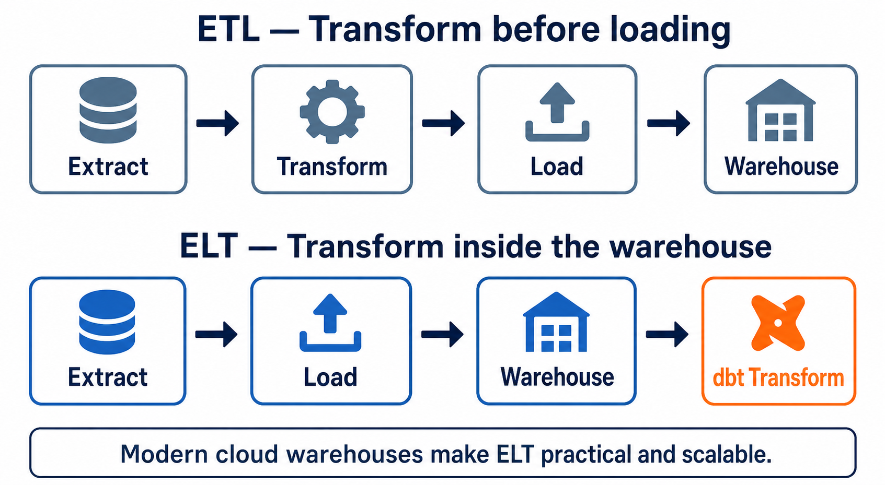

# ETL vs ELT

[← Back to Contents](README.md#course-contents) · [⌂ Back to Home Page](README.md)

## Visual Guide



### How to Explain the Diagram

1. In ETL, transformation happens before data reaches the analytical warehouse. The pipeline must know many transformation rules early.
2. In ELT, raw data is loaded first and transformed using the warehouse's compute power.
3. Modern cloud warehouses made ELT practical because storage is inexpensive and compute can scale independently.
4. dbt performs the final **T** in ELT: it transforms data that is already present in the warehouse.
5. dbt does not normally extract from source applications or load raw operational data; ingestion tools handle those stages.

Use one customer record to narrate the order in both lanes, then ask students where a cleansing rule runs in each approach.

## Tinitiate AI Solutions

### dbt Analytics Engineering Bootcamp

---

# Chapter Overview

One of the most important concepts in modern data engineering and analytics engineering is understanding the difference between ETL and ELT.

For many years organizations used ETL architectures to move and transform data.

However, the rise of cloud data warehouses such as Snowflake, BigQuery, and Redshift changed how organizations process data.

This shift led to the adoption of ELT architectures and eventually the rise of Analytics Engineering and dbt.

Understanding ETL and ELT is critical because dbt is fundamentally an ELT tool.

---

# Learning Objectives

After completing this chapter, you will be able to:

* Define ETL
* Define ELT
* Explain the differences between ETL and ELT
* Understand why organizations moved toward ELT
* Explain how Snowflake enabled ELT
* Understand where dbt fits in ELT architectures
* Identify real-world ETL and ELT implementations

---

# Understanding Data Movement

Organizations store data in many systems.

Examples:

* Salesforce
* SAP
* Oracle
* PostgreSQL
* MySQL
* Excel Files
* APIs

Business users need consolidated reporting.

This requires moving data into a centralized analytics platform.

Historically, organizations used ETL.

Today most cloud-first organizations use ELT.

---

# What is ETL?

ETL stands for:

**Extract → Transform → Load**

The process follows three steps.

---

# Step 1 – Extract

Data is extracted from source systems.

Example:

```text
SAP
Salesforce
Oracle
```

Data is copied from source systems.

---

# Step 2 – Transform

Data is transformed before loading.

Examples:

* Remove duplicates
* Standardize names
* Apply business rules
* Calculate metrics

Transformation occurs on an ETL server.

---

# Step 3 – Load

The transformed data is loaded into the warehouse.

Example:

```text
SAP
Salesforce
Oracle

      ↓

Informatica

      ↓

Enterprise Data Warehouse
```

---

# Traditional ETL Architecture

```text
Source Systems

      ↓

Extract

      ↓

ETL Server

      ↓

Transform

      ↓

Load

      ↓

Data Warehouse

      ↓

Reports
```

---

# ETL Example

Imagine employee data.

Raw Data:

| empno | ename |
| ----- | ----- |
| 7369  | smith |
| 8015  | sIMON |

Transformation Server converts:

| employee_id | employee_name |
| ----------- | ------------- |
| 7369        | Smith         |
| 8015        | Simon         |

Only after transformation is complete does the data reach the warehouse.

---

# Popular ETL Tools

Historically organizations used:

* Informatica
* DataStage
* SSIS
* Ab Initio
* Talend

These tools dominated enterprise data integration for many years.

---

# Advantages of ETL

### Better Source Protection

Transformations occur outside the warehouse.

---

### Mature Technology

ETL tools have existed for decades.

---

### Strong Governance

Traditional enterprises often have established ETL standards.

---

### Regulatory Compliance

Some organizations require transformations before storage.

---

# Limitations of ETL

As data volumes increased, ETL architectures became challenging.

---

## Expensive Infrastructure

Organizations required:

* ETL Servers
* Database Servers
* Storage Systems

Costs increased significantly.

---

## Scalability Challenges

As data grew:

* ETL Jobs became slower
* Maintenance increased
* Hardware upgrades became necessary

---

## Development Complexity

Developers needed specialized ETL skills.

Example:

* Informatica Development
* ETL Workflow Design
* Mapping Development

---

# What is ELT?

ELT stands for:

**Extract → Load → Transform**

The order changes significantly.

---

# Step 1 – Extract

Data is copied from source systems.

---

# Step 2 – Load

Raw data is immediately loaded into the warehouse.

No transformations occur yet.

---

# Step 3 – Transform

Transformations occur inside the warehouse.

This is the most important difference.

---

# ELT Architecture

```text
Source Systems

      ↓

Extract

      ↓

Load

      ↓

Snowflake

      ↓

dbt

      ↓

Business Models

      ↓

Reports
```

---

# Why ELT Became Popular

Cloud warehouses changed everything.

Examples:

* Snowflake
* BigQuery
* Redshift

These platforms provide massive compute power.

Organizations realized:

Instead of maintaining separate ETL servers, transformations could execute directly inside the warehouse.

---

# Snowflake Changed the Game

Before Snowflake:

```text
Source
   ↓
ETL Server
   ↓
Warehouse
```

After Snowflake:

```text
Source
   ↓
Snowflake
   ↓
dbt
```

The warehouse became powerful enough to perform transformations internally.

---

# ETL vs ELT Comparison

| Feature            | ETL        | ELT       |
| ------------------ | ---------- | --------- |
| Transform Location | ETL Server | Warehouse |
| Data Loaded First  | No         | Yes       |
| Scalability        | Limited    | High      |
| Infrastructure     | Complex    | Simpler   |
| Cloud Friendly     | Moderate   | Excellent |
| dbt Compatible     | No         | Yes       |

---

# Visual Comparison

## ETL

```text
SAP
Salesforce

      ↓

Transform

      ↓

Warehouse
```

---

## ELT

```text
SAP
Salesforce

      ↓

Warehouse

      ↓

dbt

      ↓

Business Models
```

---

# Where dbt Fits

This is one of the most important concepts in the entire bootcamp.

dbt operates in the transformation phase of ELT.

Example:

```text
Salesforce

      ↓

Fivetran

      ↓

Snowflake

      ↓

dbt

      ↓

dim_customer

      ↓

Power BI
```

---

# Real Project Example

Using the Employee Analytics Project:

Source Tables:

```text
emp
dept
projects
emp_projects
```

Loaded into Snowflake.

Raw Tables:

```text
emp
dept
```

dbt Creates:

```text
stg_emp
stg_dept
```

Then:

```text
dim_employee
fact_employee_projects
```

This is a classic ELT implementation.

---

# Why Modern Companies Prefer ELT

Benefits include:

### Simpler Architecture

Fewer moving parts.

---

### Better Scalability

Warehouse compute scales on demand.

---

### Faster Development

Developers primarily use SQL.

---

### Better Analytics Engineering Support

dbt integrates naturally with ELT.

---

### Lower Operational Complexity

Less infrastructure to maintain.

---

# Common Interview Question

Question:

Why did organizations move from ETL to ELT?

Expected Answer:

Cloud data warehouses became powerful enough to perform transformations internally, reducing infrastructure complexity and improving scalability.

---

# Real World Migration Example

Legacy Environment:

```text
SAP

↓

Informatica

↓

Teradata
```

Modern Environment:

```text
SAP

↓

Fivetran

↓

Snowflake

↓

dbt
```

Benefits:

* Reduced maintenance
* Faster delivery
* Better scalability
* Improved governance

---

# Instructor Talking Points

## Discussion Question

Ask students:

Why maintain a separate ETL server if Snowflake already provides powerful compute resources?

Allow discussion.

Then introduce ELT.

---

## Whiteboard Exercise

Draw both architectures.

### ETL

```text
Source
 ↓
Transform
 ↓
Warehouse
```

### ELT

```text
Source
 ↓
Warehouse
 ↓
Transform
```

Ask students to identify the difference.

---

## Industry Examples

Traditional ETL:

* Informatica
* DataStage
* SSIS

Modern ELT:

* Snowflake
* dbt
* Fivetran

---

# Common Mistakes

## Mistake 1

Thinking ETL and ELT are the same.

The transformation location is different.

---

## Mistake 2

Thinking dbt performs extraction.

dbt performs transformation.

---

## Mistake 3

Thinking ELT eliminates governance.

Governance remains critical.

---

## Mistake 4

Thinking ELT automatically improves data quality.

Data quality still requires testing and validation.

---

# Knowledge Check

1. What does ETL stand for?
2. What does ELT stand for?
3. What is the primary difference between ETL and ELT?
4. Why did ELT become popular?
5. Where does dbt fit?
6. Why is Snowflake important to ELT?

---

# Interview Questions

## Beginner

What is ETL?

What is ELT?

How are they different?

---

## Intermediate

Why did cloud data warehouses enable ELT?

How does dbt support ELT architectures?

What advantages does ELT provide?

---

## Scenario

Your company currently uses Informatica and Teradata.

Leadership wants to modernize the platform using Snowflake and dbt.

How would you explain the benefits of ELT?

---

# Hands-On Exercise

Using the Employee Analytics dataset:

Identify:

1. Source Systems
2. Loading Tool
3. Warehouse
4. Transformation Layer
5. Reporting Layer

Create an architecture diagram showing the complete ELT flow.

---

# Assignment

Create a comparison document between ETL and ELT.

Include:

* Architecture diagrams
* Advantages
* Disadvantages
* Example technologies
* Real-world use cases

---

# Chapter Summary

In this chapter we learned:

* ETL stands for Extract, Transform, Load.
* ELT stands for Extract, Load, Transform.
* ETL performs transformations before loading.
* ELT performs transformations inside the warehouse.
* Snowflake enabled large-scale ELT adoption.
* dbt is an ELT transformation framework.
* Most modern analytics platforms use ELT architectures.
* ELT is the foundation of Analytics Engineering.

---

[← Back to Contents](README.md#course-contents) · [⌂ Back to Home Page](README.md)
