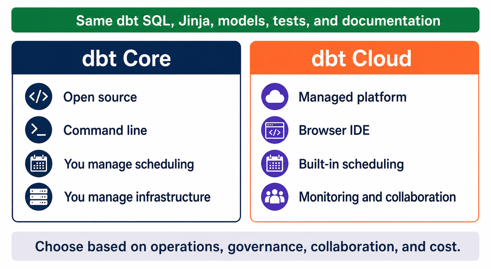

# dbt Core vs dbt Cloud

[← Back to Contents](README.md#course-contents) · [⌂ Back to Home Page](README.md)

## Tinitiate AI Solutions

### dbt Analytics Engineering Bootcamp

---

# Chapter Overview

One of the first decisions organizations make when adopting dbt is choosing between:

* dbt Core
* dbt Cloud

Both products use the same dbt framework and transformation engine.

However, they differ significantly in:

* Installation
* Development Experience
* Scheduling
* Collaboration
* Deployment
* Governance
* Cost

Understanding these differences is important for both interviews and real-world implementations.

By the end of this chapter, you will understand:

* When to use dbt Core
* When to use dbt Cloud
* Advantages and limitations of each
* Enterprise adoption patterns
* Interview-ready explanations

## Visual Guide



### Diagram Explanation

1. Start with what is shared: models, SQL, Jinja, testing, documentation, and lineage concepts.
2. dbt Core is installed locally or on team-managed infrastructure and is usually operated through the command line.
3. Core can be scheduled with tools such as Airflow, GitHub Actions, or another orchestrator, but the team owns that integration.
4. dbt Cloud provides managed development and deployment capabilities, including scheduling, monitoring, and collaboration.
5. The correct choice depends less on transformation syntax and more on the organization's operating model.

The operational tradeoff becomes clear when comparing a two-person startup using GitHub Actions with a regulated enterprise supporting many analytics teams.

---

# Learning Objectives

After completing this chapter, you will be able to:

* Define dbt Core
* Define dbt Cloud
* Compare Core and Cloud
* Understand deployment options
* Explain enterprise use cases
* Recommend the appropriate option for different scenarios

---

# Evolution of dbt

When dbt was first introduced, only dbt Core existed.

Developers installed dbt locally and executed commands from their computers.

Example:

```bash id="od6tqk"
dbt run
dbt test
dbt docs generate
```

As adoption increased, organizations requested:

* Scheduling
* Collaboration
* Governance
* Centralized Management

This led to the creation of dbt Cloud.

---

# What is dbt Core?

dbt Core is the open-source version of dbt.

It contains the transformation engine used by all dbt implementations.

Developers install it locally.

Example:

```bash id="2e2x8m"
pip install dbt-core
```

Example adapters:

```bash id="3g5kgm"
pip install dbt-snowflake

pip install dbt-bigquery

pip install dbt-redshift
```

---

# Key Characteristics of dbt Core

### Open Source

Free to use.

---

### Local Installation

Runs on:

* Windows
* Linux
* macOS

---

### Command Line Interface

Users execute commands manually.

Examples:

```bash id="l8g7xl"
dbt run
dbt test
dbt compile
dbt docs generate
```

---

### Git Integration

Works naturally with Git.

---

### Flexible

Can integrate with:

* Jenkins
* GitHub Actions
* Azure DevOps
* Airflow

---

# Typical dbt Core Architecture

```text
Developer Laptop

        ↓

dbt Core

        ↓

Snowflake

        ↓

Business Models
```

---

# Advantages of dbt Core

## Cost Effective

Open source.

No licensing fees.

---

## Full Control

Organizations control:

* Infrastructure
* Scheduling
* Deployment

---

## Flexible Integrations

Can integrate with almost any CI/CD platform.

---

## Excellent for Learning

Beginners should start with dbt Core.

Why?

It teaches:

* Installation
* Configuration
* Project Structure
* Deployment Concepts

---

# Limitations of dbt Core

## No Built-in Scheduler

Developers must use:

* Airflow
* GitHub Actions
* Jenkins
* Cron Jobs

---

## No Web IDE

Requires:

* VS Code
* PyCharm
* Other IDEs

---

## More Operational Responsibility

Teams manage:

* Scheduling
* CI/CD
* Monitoring

---

# What is dbt Cloud?

dbt Cloud is the managed SaaS version of dbt.

It includes:

* dbt Core Engine
* Scheduling
* Collaboration Features
* Deployment Tools
* Monitoring

Hosted by dbt Labs.

---

# Key Characteristics of dbt Cloud

### Web-Based

No local installation required.

Users access through a browser.

---

### Managed Platform

dbt Labs manages infrastructure.

---

### Built-in Scheduler

Jobs can be scheduled directly.

Example:

```text
Every Day
2:00 AM
```

No Airflow required.

---

### Collaboration

Supports:

* Multiple Developers
* Shared Projects
* Role-Based Access

---

### Monitoring

Provides visibility into:

* Job Runs
* Failures
* Logs

---

# Typical dbt Cloud Architecture

```text
Developer

      ↓

dbt Cloud

      ↓

Snowflake

      ↓

Business Models
```

---

# Advantages of dbt Cloud

## Faster Onboarding

Developers begin quickly.

Minimal setup required.

---

## Built-In Scheduler

No separate orchestration platform required.

---

## Better Collaboration

Centralized development environment.

---

## Reduced Maintenance

dbt Labs manages infrastructure.

---

## Enterprise Features

Includes:

* Governance
* Monitoring
* Deployment Workflows

---

# Limitations of dbt Cloud

## Licensing Costs

Organizations pay subscription fees.

---

## Less Infrastructure Control

Managed environment.

---

## Dependency on Vendor

Organizations rely on dbt Labs.

---

# Core vs Cloud Comparison

| Feature       | Core         | Cloud     |
| ------------- | ------------ | --------- |
| Cost          | Free         | Paid      |
| Open Source   | Yes          | Uses Core |
| Scheduler     | No           | Yes       |
| Web IDE       | No           | Yes       |
| Monitoring    | Limited      | Built-In  |
| Collaboration | Git-Based    | Native    |
| Deployment    | Self-Managed | Managed   |
| Learning      | Excellent    | Good      |
| Enterprise    | Good         | Excellent |

---

# Understanding Scheduling

One major difference is scheduling.

---

## dbt Core Scheduling

Requires external tools.

Example:

```text
Airflow
      ↓
dbt run
```

or

```text
GitHub Actions
      ↓
dbt run
```

---

## dbt Cloud Scheduling

Built directly into the platform.

Example:

```text
2 AM Daily
      ↓
dbt Cloud Job
      ↓
dbt run
```

---

# Understanding Development Experience

## dbt Core

Developers typically use:

* VS Code
* Terminal
* Git

Workflow:

```text
Code
   ↓
Commit
   ↓
Push
   ↓
Deploy
```

---

## dbt Cloud

Developers can work directly in a browser.

Workflow:

```text
Browser IDE
      ↓
Commit
      ↓
Deploy
```

---

# Real World Enterprise Example

Small Startup

Requirements:

* Low Cost
* Few Developers

Recommendation:

dbt Core

---

Medium Company

Requirements:

* Scheduling
* Collaboration

Recommendation:

dbt Cloud

---

Large Enterprise

Requirements:

* Governance
* Monitoring
* Multiple Teams

Recommendation:

dbt Cloud Enterprise

---

# What Should Students Learn?

For this bootcamp:

Recommendation:

### Learn dbt Core First

Reasons:

* Understand fundamentals
* Learn project structure
* Learn configuration
* Learn deployment concepts

Once fundamentals are mastered:

Learn dbt Cloud.

---

# Real Project Example

Employee Analytics Project

Development:

```text
VS Code
   ↓
dbt Core
   ↓
Snowflake
```

This is the approach used throughout this course.

Later we will discuss how enterprises deploy the same project using dbt Cloud.

---

# Review and Applied Learning

## Reflection Question

Why would a company pay for dbt Cloud when dbt Core is free?

Key considerations:

* Scheduling
* Monitoring
* Governance
* Collaboration

---

## Architecture Exercise

Comparison:

### Core

```text
Developer
    ↓
dbt Core
    ↓
Snowflake
```

### Cloud

```text
Developer
    ↓
dbt Cloud
    ↓
Snowflake
```

The comparison highlights differences in operational ownership.

---

## Industry Example

Consider an organization with:

* 20 Analytics Engineers
* 50 Analysts
* 500 Models

At this scale, governance becomes essential for consistency, ownership, access control, and reliable deployment.

---

# Common Mistakes

## Mistake 1

Thinking dbt Cloud is a different product.

Reality:

dbt Cloud uses the same dbt engine.

---

## Mistake 2

Thinking dbt Cloud eliminates Git.

Reality:

Git remains essential.

---

## Mistake 3

Thinking dbt Core cannot scale.

Reality:

Many large organizations successfully use dbt Core.

---

## Mistake 4

Choosing Cloud before understanding Core concepts.

Master dbt Core fundamentals first.

---

# Knowledge Check

1. What is dbt Core?
2. What is dbt Cloud?
3. Which version is open source?
4. Which version includes scheduling?
5. Which version includes a web IDE?
6. Which version should beginners learn first?

---

# Interview Questions

## Beginner

What is dbt Core?

What is dbt Cloud?

What are the major differences?

---

## Intermediate

When would you choose dbt Cloud?

How does scheduling work in dbt Core?

What advantages does dbt Cloud provide?

---

## Scenario

Your company currently uses dbt Core.

Management wants:

* Scheduling
* Monitoring
* Centralized Development

Would you recommend dbt Cloud? Why?

---

# Hands-On Exercise

Research:

* dbt Core
* dbt Cloud

Create a comparison table containing:

* Cost
* Scheduling
* Deployment
* Collaboration
* Monitoring

Present findings to the class.

---

# Assignment

Design a dbt implementation strategy for:

1. Startup
2. Mid-Sized Company
3. Enterprise Organization

For each scenario:

* Recommend Core or Cloud
* Explain your reasoning
* Identify potential challenges

---

# Chapter Summary

In this chapter we learned:

* dbt Core is the open-source version of dbt.
* dbt Cloud is the managed SaaS offering from dbt Labs.
* Core provides flexibility and cost advantages.
* Cloud provides scheduling, collaboration, and governance.
* Both use the same transformation engine.
* Learning dbt Core first provides a strong foundation.
* Organizations choose between Core and Cloud based on requirements, scale, and operational maturity.

---

[← Back to Contents](README.md#course-contents) · [⌂ Back to Home Page](README.md)
