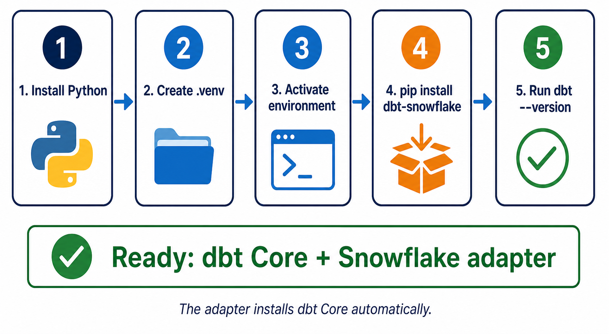

# Installing dbt

[← Back to Contents](README.md#course-contents) · [⌂ Back to Home Page](README.md)

## Visual Guide



### How to Explain the Diagram

1. Python provides the runtime used by the dbt Core v1 command-line workflow taught in this course.
2. A virtual environment isolates dbt and its Python packages from other projects on the computer.
3. Activation makes `python`, `pip`, and `dbt` point to that isolated environment.
4. Installing `dbt-snowflake` installs both the Snowflake adapter and a compatible dbt Core version.
5. `dbt --version` is the first checkpoint; it should display Core and the Snowflake plugin before connection work begins.

Do not treat installation as complete merely because `pip` finished. Verify the active terminal, dbt version, adapter, and then the Snowflake connection with `dbt debug`.

Continue with the [line-by-line installation practical](00_hands_on_dbt_practical.md#2-download-and-install-dbt-core).

## Downloads and Installation Links

| Tool | Official link | Why students need it |
| --- | --- | --- |
| dbt | [Official dbt installation guide](https://docs.getdbt.com/docs/local/install-dbt) | Lists supported installation methods |
| Python | [Download Python](https://www.python.org/downloads/) | Runs the dbt Core command-line workflow |
| Git | [Download Git](https://git-scm.com/downloads/) | Downloads and version-controls course projects |
| VS Code | [Download VS Code](https://code.visualstudio.com/download) | Edits SQL, YAML, CSV, and Markdown files |

For this Snowflake course, run:

```powershell
python -m pip install --upgrade pip
python -m pip install dbt-snowflake
dbt --version
```

There is no separate dbt Core desktop installer required for this course. Installing `dbt-snowflake` downloads both the Snowflake adapter and a compatible `dbt-core` package.

## Tinitiate AI Solutions

### dbt Analytics Engineering Bootcamp

---

# Chapter Overview

Before we can build models, tests, documentation, and analytics solutions using dbt, we must first install and configure our local development environment.

Many beginners struggle during installation because they are unfamiliar with:

* Python
* Package Managers
* Virtual Environments
* Terminal Commands
* Environment Variables

This chapter walks through the installation process step-by-step and explains not only what to do, but why each step is important.

By the end of this chapter students will have:

* Python Installed
* Virtual Environment Configured
* dbt Core Installed
* Snowflake Adapter Installed
* VS Code Configured
* dbt Verified and Ready for Development

---

# Learning Objectives

After completing this chapter, students will be able to:

* Understand dbt prerequisites
* Install Python
* Create virtual environments
* Install dbt Core
* Install dbt adapters
* Verify installations
* Configure VS Code
* Troubleshoot common installation issues

---

# Why Installation Matters

One of the biggest frustrations for new developers is spending hours troubleshooting environment issues.

Professional Analytics Engineers understand:

The development environment is part of the project.

A properly configured environment provides:

* Consistency
* Reproducibility
* Easier Troubleshooting
* Better Collaboration

---

# Understanding Prerequisites

Before installing dbt, we must install several dependencies.

Required:

```text
Python
PIP
Virtual Environment
Code Editor
Git
```

Optional but Recommended:

```text
Snowflake Account
VS Code Extensions
GitHub Account
```

---

# What is Python?

dbt is written in Python.

When you run:

dbt run

You are executing a Python application.

Because of this, Python must be installed before dbt.

---

# Understanding Python Versions

Not all Python versions are supported.

Recommended:

```text
Python 3.11
Python 3.12
```

Avoid:

```text
Python 2.x
```

Older versions are no longer supported.

---

# Installing Python on Windows

Step 1

Visit:

https://python.org

Download the latest stable release.

---

Step 2

Run the installer.

IMPORTANT:

Select:

```text
Add Python to PATH
```

Many students forget this step.

---

Step 3

Open Command Prompt.

Verify:

```bash
python --version
```

Expected:

```text
Python 3.x.x
```

---

# Installing Python on macOS

Verify existing installation:

```bash
python3 --version
```

If missing:

```bash
brew install python
```

Verify again:

```bash
python3 --version
```

---

# Installing Python on Linux

Ubuntu Example:

```bash
sudo apt update

sudo apt install python3
```

Verify:

```bash
python3 --version
```

---

# Understanding PIP

PIP stands for:

Package Installer for Python.

PIP installs Python libraries.

Examples:

```bash
pip install pandas

pip install numpy

pip install dbt-core
```

---

# Verify PIP

Execute:

```bash
pip --version
```

Expected:

```text
pip 24.x.x
```

If pip is missing:

```bash
python -m ensurepip
```

---

# What is a Virtual Environment?

One of the most important concepts in Python development.

A virtual environment creates an isolated workspace.

Without virtual environments:

```text
Project A
Project B
Project C
```

share the same dependencies.

This causes conflicts.

---

# Why Use Virtual Environments?

Example:

Project A requires:

```text
dbt 1.7
```

Project B requires:

```text
dbt 1.9
```

Without isolation:

Conflicts occur.

Virtual environments solve this problem.

---

# Creating a Virtual Environment

Create project folder:

```bash
mkdir employee_project

cd employee_project
```

Create environment:

```bash
python -m venv venv
```

This creates:

```text
employee_project
│
├── venv
```

---

# Activate Virtual Environment

Windows:

```bash
venv\Scripts\activate
```

Expected:

```text
(venv)
C:\employee_project>
```

---

macOS/Linux:

```bash
source venv/bin/activate
```

Expected:

```text
(venv)
$
```

---

# Why Activation Matters

Once activated:

All packages install inside the environment.

Instead of globally.

This prevents conflicts.

---

# Installing dbt Core

Now install dbt.

Command:

```bash
pip install dbt-core
```

Installation may take several minutes.

---

# What Gets Installed?

Many students think:

Only dbt installs.

Actually several Python dependencies install.

Examples:

* click
* jinja2
* agate
* sqlparse

These libraries support dbt functionality.

---

# Verify dbt Installation

Run:

```bash
dbt --version
```

Expected:

```text
Core:
  1.x.x
```

Example:

```text
Core:
  1.9.0
```

---

# Understanding Adapters

dbt itself does not know how to communicate with Snowflake.

An adapter provides database-specific functionality.

Think of adapters as translators.

---

# Common Adapters

Snowflake:

```bash
pip install dbt-snowflake
```

BigQuery:

```bash
pip install dbt-bigquery
```

Redshift:

```bash
pip install dbt-redshift
```

Postgres:

```bash
pip install dbt-postgres
```

---

# Installing Snowflake Adapter

Since this course uses Snowflake:

Execute:

```bash
pip install dbt-snowflake
```

---

# Verify Snowflake Adapter

Run:

```bash
dbt --version
```

Expected:

```text
Plugins:
  snowflake
```

Example:

```text
Plugins:
  snowflake: 1.9.0
```

---

# Installing VS Code

VS Code is the recommended editor.

Benefits:

* Free
* Lightweight
* Excellent dbt support

Download:

https://code.visualstudio.com

---

# Recommended Extensions

Install:

### Python

Provides:

* Syntax Highlighting
* Debugging

---

### YAML

Provides:

* YAML Formatting
* Validation

---

### GitLens

Provides:

* Git Insights
* History Tracking

---

### SQL Formatter

Improves readability.

---

### Markdown Preview

Useful for documentation.

---

# Understanding Git

Every dbt project should use Git.

Benefits:

* Version Control
* Collaboration
* Rollback Capability

Install:

https://git-scm.com

Verify:

```bash
git --version
```

---

# Recommended Project Setup

```text
employee_analytics
│
├── venv
├── dbt_project
├── docs
├── scripts
└── README.md
```

This structure scales well.

---

# Common Installation Errors

## Error 1

```text
python is not recognized
```

Cause:

Python not added to PATH.

Fix:

Reinstall Python and enable:

```text
Add Python to PATH
```

---

## Error 2

```text
pip not found
```

Cause:

PIP missing.

Fix:

```bash
python -m ensurepip
```

---

## Error 3

```text
dbt command not found
```

Cause:

Virtual environment not activated.

Fix:

Activate environment.

---

## Error 4

```text
No module named dbt
```

Cause:

dbt not installed.

Fix:

```bash
pip install dbt-core
```

---

## Error 5

```text
No adapter found
```

Cause:

Snowflake adapter missing.

Fix:

```bash
pip install dbt-snowflake
```

---

# Installation Checklist

Verify:

✅ Python Installed

✅ PIP Installed

✅ Virtual Environment Created

✅ dbt Core Installed

✅ dbt Snowflake Installed

✅ VS Code Installed

✅ Git Installed

---

# Instructor Talking Points

## Discussion Question

Ask:

Why do developers use virtual environments?

Expected Answers:

* Isolation
* Dependency Management
* Reproducibility

---

## Whiteboard Exercise

Draw:

Without Virtual Environment:

```text
Python
  ↓
Project A
Project B
Project C
```

Problems:

Conflicts

---

With Virtual Environment:

```text
Project A
  ↓
venv

Project B
  ↓
venv
```

Explain isolation.

---

# Hands-On Lab

## Lab Goal

Prepare a complete dbt development environment.

---

## Tasks

1. Install Python
2. Verify Python
3. Create Virtual Environment
4. Activate Environment
5. Install dbt Core
6. Install dbt Snowflake
7. Verify Installation
8. Install VS Code Extensions

---

# Knowledge Check

1. Why does dbt require Python?
2. What is PIP?
3. What is a virtual environment?
4. Why are adapters required?
5. Which adapter do we use in this course?
6. Why should we use Git?

---

# Interview Questions

## Beginner

What are the prerequisites for dbt?

How do you install dbt?

What is a virtual environment?

---

## Intermediate

Why do dbt adapters exist?

How do you troubleshoot installation issues?

Why should dbt projects use Git?

---

## Scenario

A new team member cannot run:

```bash
dbt run
```

and receives:

```text
dbt command not found
```

How would you troubleshoot the issue?

---

# Assignment

Prepare your development environment.

Submit screenshots of:

1. Python Version
2. PIP Version
3. dbt Version
4. Snowflake Adapter Installed
5. VS Code Environment

---

# Chapter Summary

In this chapter we learned:

* dbt requires Python.
* Virtual environments isolate dependencies.
* dbt Core is installed using PIP.
* Adapters connect dbt to databases.
* The Snowflake adapter is required for this course.
* VS Code and Git are essential tools.
* Proper environment setup reduces future issues.

Students should now have a fully functional dbt development environment ready for project creation.

---

[← Back to Contents](README.md#course-contents) · [⌂ Back to Home Page](README.md)
