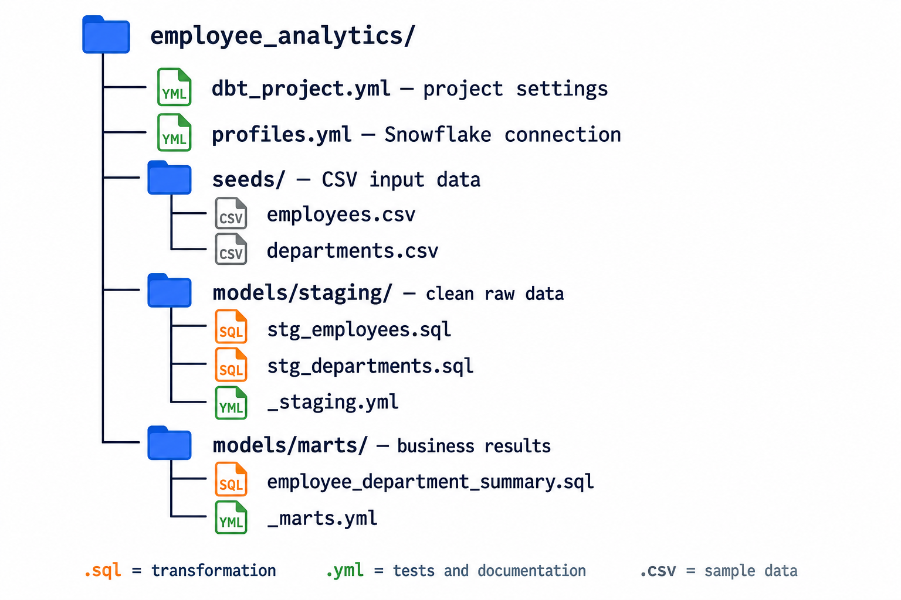

# dbt Project Structure

[← Back to Contents](README.md#course-contents) · [⌂ Back to Home Page](README.md)

## Visual Guide



### Diagram Explanation

1. `dbt_project.yml` identifies the project and configures paths and materializations.
2. `profiles.yml` supplies connection details; credentials should not be committed to Git.
3. `seeds/` contains small CSV datasets used for reference data or classroom input.
4. `models/staging/` cleans and standardizes source-shaped data with minimal business aggregation.
5. `models/marts/` contains business-facing results designed for reporting and analysis.
6. `.sql` files define transformations, while `.yml` files add descriptions, tests, and other properties.
7. Generated folders such as `target/` and `logs/` are useful for debugging but should normally be ignored by Git.

A currency mapping CSV belongs in `seeds/`, a cleaned customer model belongs in staging, and a monthly revenue table belongs in a business-facing mart.

## Tinitiate AI Solutions

### dbt Analytics Engineering Bootcamp

---

# Chapter Overview

One of the biggest advantages of dbt is that it provides a standardized project structure.

In traditional environments, developers often create SQL files wherever they want.

Example:

```text
Desktop/
   sales_query.sql

Downloads/
   revenue_report.sql

SharedFolder/
   customer_final_v4.sql
```

Over time this becomes impossible to manage.

dbt solves this problem by providing a consistent project structure.

Every dbt project follows a predictable layout.

This makes:

* Development easier
* Collaboration simpler
* Maintenance faster
* Onboarding smoother

Understanding the project structure is critical because students will spend most of their time working within these folders.

---

# Learning Objectives

After completing this chapter, students will be able to:

* Create a dbt project
* Understand all major project folders
* Understand how dbt organizes code
* Identify where different components belong
* Follow enterprise project standards
* Build scalable project structures

---

# Creating Your First dbt Project

After installing dbt, create a project.

Execute:

```bash
dbt init employee_analytics
```

dbt creates a project automatically.

Example:

```text
employee_analytics/
│
├── analyses
├── macros
├── models
├── seeds
├── snapshots
├── tests
├── dbt_project.yml
└── README.md
```

---

# Understanding What dbt Generates

Many beginners create projects but do not understand why these folders exist.

A professional Analytics Engineer should understand every folder.

Think of the project structure as a blueprint for organizing analytics code.

---

# Root Project Folder

Example:

```text
employee_analytics/
```

This is the project root.

Everything related to the project exists underneath this directory.

Benefits:

* Centralized Development
* Easier Version Control
* Better Organization

---

# dbt_project.yml

This is the most important file in the project.

Purpose:

Project Configuration.

Example:

```yaml
name: employee_analytics

version: '1.0'

profile: employee_analytics
```

Responsibilities:

* Project Settings
* Folder Configuration
* Materializations
* Variables
* Package Management

Think of this as the brain of the project.

---

# models Folder

The most important folder.

Location:

```text
models/
```

Purpose:

Contains transformation logic.

Example:

```text
models/
├── stg_emp.sql
├── stg_dept.sql
├── dim_employee.sql
```

dbt executes these files and creates tables or views.

---

# Why Models Matter

Models are where Analytics Engineering happens.

Example:

Raw Table:

```text
employees.emp
```

Business Model:

```text
dim_employee
```

Models transform technical data into business-ready information.

---

# Enterprise Model Organization

A common enterprise structure:

```text
models/
│
├── staging
│
├── intermediate
│
└── marts
```

This architecture will be used throughout the course.

---

# Staging Layer

Purpose:

Clean raw data.

Examples:

```text
stg_emp
stg_dept
stg_projects
```

Responsibilities:

* Rename Columns
* Standardize Values
* Remove Unnecessary Fields

---

# Example Staging Model

```sql
select

    empno as employee_id,

    initcap(trim(ename)) as employee_name,

    deptno as department_id

from employees.emp
```

Notice:

* Better Naming
* Cleaner Data

---

# Intermediate Layer

Purpose:

Apply business logic.

Examples:

```text
int_employee_department

int_employee_projects
```

Responsibilities:

* Joins
* Aggregations
* Business Rules

---

# Example Intermediate Model

```sql
select

    e.employee_id,

    e.employee_name,

    d.department_name

from {{ ref('stg_emp') }} e

join {{ ref('stg_dept') }} d

on e.department_id = d.department_id
```

---

# Mart Layer

Purpose:

Business-ready reporting.

Examples:

```text
dim_employee

fact_employee_projects

fact_department_salary
```

Business users should consume marts rather than raw tables.

---

# Example Mart Model

```sql
select *

from {{ ref('int_employee_department') }}
```

Simple but business-friendly.

---

# Visualizing the Model Flow

```text
Raw Tables

      ↓

Staging

      ↓

Intermediate

      ↓

Marts

      ↓

Dashboards
```

This is one of the most important diagrams in dbt.

This layered architecture is a useful reference for organizing production projects.

---

# macros Folder

Location:

```text
macros/
```

Purpose:

Reusable SQL.

Example:

Instead of repeating:

```sql
upper(trim(employee_name))
```

50 times,

create a macro:

```sql
clean_name(employee_name)
```

Benefits:

* Reusability
* Consistency
* Easier Maintenance

---

# Why Macros Matter

Imagine:

50 models.

Revenue calculation changes.

Without macros:

Update 50 files.

With macros:

Update 1 file.

---

# seeds Folder

Location:

```text
seeds/
```

Purpose:

Store CSV files.

Example:

```text
department_lookup.csv

country_lookup.csv
```

dbt loads these files into Snowflake.

---

# Example Seed File

```csv
department_id,department_name

10,HR

20,Finance

30,IT
```

Load using:

```bash
dbt seed
```

---

# Why Seeds Are Useful

Small reference data often changes infrequently.

Examples:

* Country Codes
* Status Codes
* Department Mappings

Seeds provide a simple solution.

---

# snapshots Folder

Location:

```text
snapshots/
```

Purpose:

Track historical changes.

Example:

Customer Salary:

Before:

```text
50000
```

After:

```text
60000
```

Snapshots preserve both versions.

---

# Why Snapshots Matter

Businesses often need:

* Historical Reporting
* Audit Trails
* SCD Type 2

Snapshots provide these capabilities.

---

# tests Folder

Location:

```text
tests/
```

Purpose:

Custom Data Quality Validation.

Examples:

* Business Rules
* Data Validation
* Custom Checks

---

# Example Custom Test

```sql
select *

from employees

where salary < 0
```

Any returned rows indicate failure.

---

# analyses Folder

Location:

```text
analyses/
```

Purpose:

Ad-hoc SQL.

Examples:

* Research Queries
* Exploratory Analysis
* Temporary Investigations

These files are not executed as models.

---

# Example Analysis

```sql
select

    department_name,

    count(*)

from dim_employee

group by department_name
```

Useful for exploration.

---

# target Folder

Generated Automatically.

Location:

```text
target/
```

Purpose:

Compiled Artifacts.

Contains:

* Compiled SQL
* Run Results
* Manifest Files

---

# Why Target Exists

When dbt runs:

It converts:

```sql
{{ ref('stg_emp') }}
```

into actual Snowflake SQL.

Compiled results are stored in:

```text
target/
```

---

# logs Folder

Generated Automatically.

Location:

```text
logs/
```

Purpose:

Execution Logs.

Useful for:

* Troubleshooting
* Debugging
* Auditing

---

# Typical Enterprise Structure

Example:

```text
employee_analytics/
│
├── models
│   ├── staging
│   ├── intermediate
│   └── marts
│
├── macros
│
├── tests
│
├── snapshots
│
├── seeds
│
├── analyses
│
├── target
│
├── logs
│
└── dbt_project.yml
```

This structure scales effectively.

---

# Real Project Example

Employee Analytics Platform

```text
models/
│
├── staging
│   ├── stg_emp.sql
│   ├── stg_dept.sql
│
├── intermediate
│   ├── int_employee_department.sql
│
└── marts
    ├── dim_employee.sql
    └── fact_employee_projects.sql
```

This is the structure students will build.

---

# Review and Applied Learning

## Reflection Question

Why not place all SQL files in a single folder?

Key considerations:

* Difficult Maintenance
* Poor Organization
* Scalability Issues

Layered architecture addresses these organization and scaling concerns.

---

## Architecture Exercise

Reference architecture:

```text
Raw

 ↓

Staging

 ↓

Intermediate

 ↓

Mart

 ↓

Dashboard
```

Each layer has a distinct transformation responsibility.

---

## Real World Discussion

Imagine:

500 models.

Would a flat structure work?

No.

Enterprise projects require organization.

---

# Common Mistakes

## Mistake 1

Putting all models in one folder.

---

## Mistake 2

Skipping staging layer.

---

## Mistake 3

Creating business logic directly in marts.

---

## Mistake 4

Not using macros.

---

## Mistake 5

Using seeds for large datasets.

Seeds are intended for small reference data.

---

# Knowledge Check

1. What is the purpose of models?
2. What belongs in staging?
3. What belongs in intermediate?
4. What belongs in marts?
5. What are macros?
6. What are seeds?
7. What are snapshots?
8. Why does dbt generate target files?

---

# Interview Questions

## Beginner

What folders are created by dbt init?

What is the purpose of models?

What is a seed?

---

## Intermediate

Explain staging, intermediate, and marts.

Why are macros useful?

What is stored in target?

---

## Scenario

A project contains 300 models.

How would you organize them?

Explain your folder structure.

---

# Hands-On Lab

Create:

```text
employee_analytics/
│
├── models
│   ├── staging
│   ├── intermediate
│   └── marts
```

Create:

```text
stg_emp.sql

stg_dept.sql

int_employee_department.sql

dim_employee.sql
```

Verify structure.

---

# Assignment

Design a dbt project structure for:

* HR Analytics
* Sales Analytics
* Finance Analytics

Include:

* Folder Layout
* Naming Standards
* Layered Architecture

---

# Chapter Summary

In this chapter we learned:

* dbt projects follow a standardized structure.
* models is the most important folder.
* staging cleans raw data.
* intermediate applies business logic.
* marts provide business-ready datasets.
* macros improve reusability.
* seeds manage reference data.
* snapshots track history.
* target stores compiled artifacts.
* proper organization is essential for enterprise-scale projects.

---

[← Back to Contents](README.md#course-contents) · [⌂ Back to Home Page](README.md)
